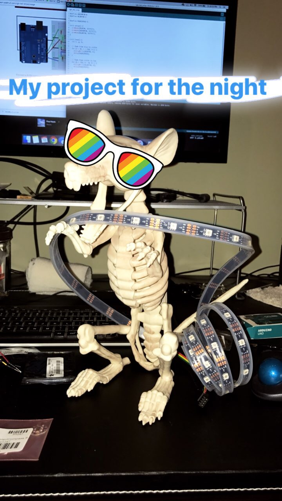
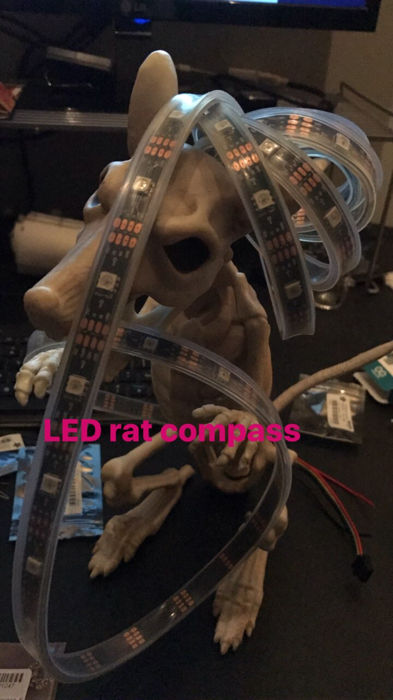
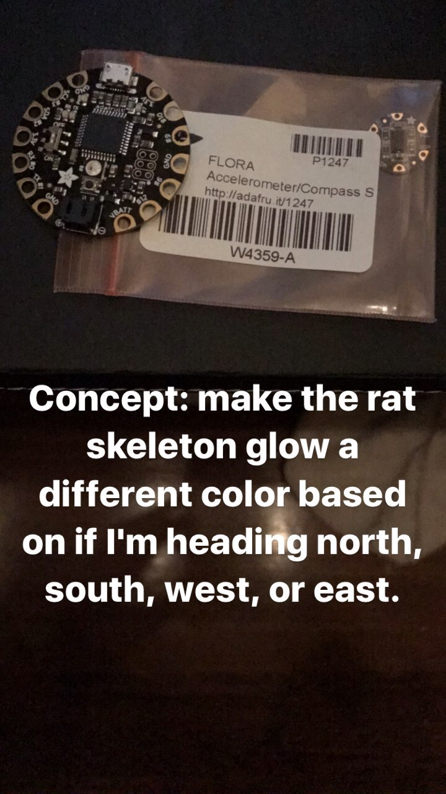
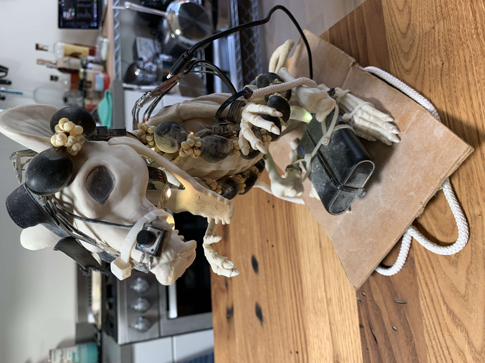
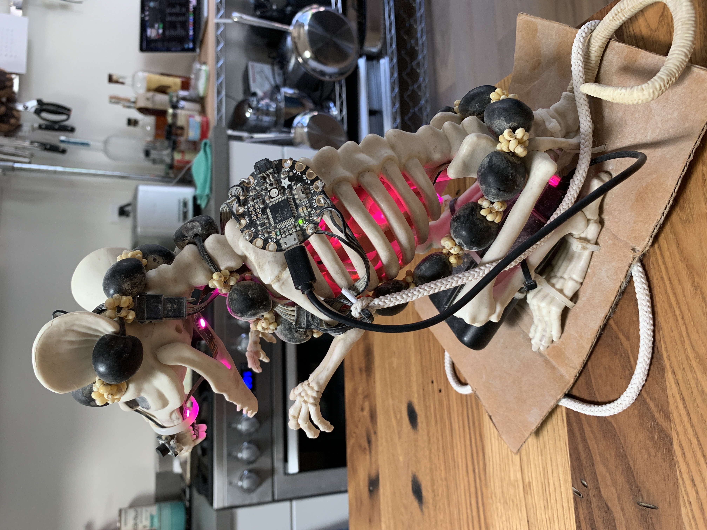
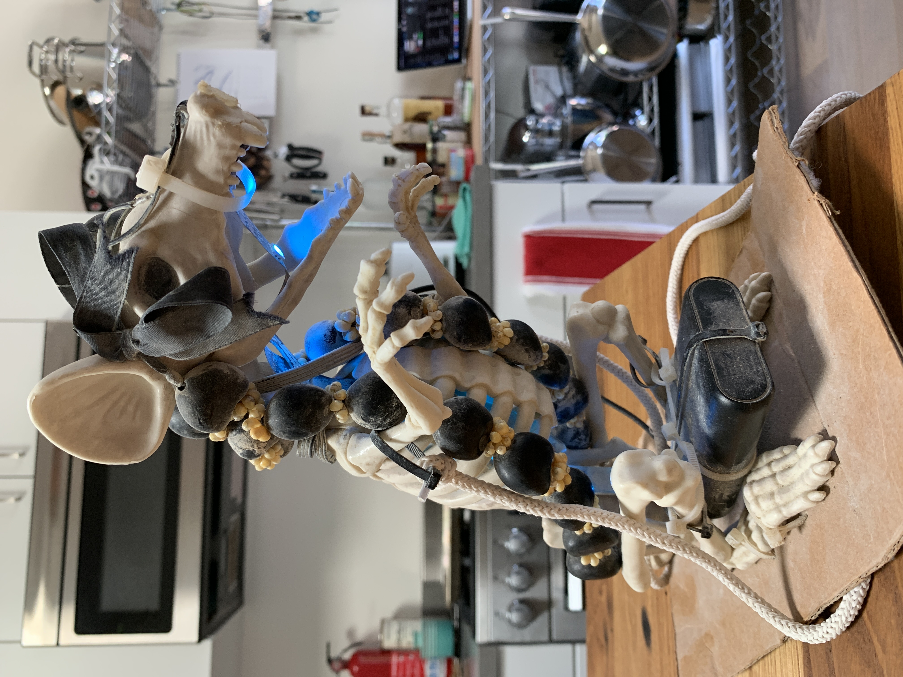

import ColorWheel from "../../../src/components/ColorWheel";

# Rat Compass

## Overview

It started with this thought:

> What if we made use of color to give us direction?
> What would that look like?

No, I don't have [Synesthesia](https://en.wikipedia.org/wiki/Synesthesia), but I do have some LEDs, a Magnetometer (Compass) sensor, and a plastic rat skeleton... let's light this thing up and make some art!

**Presenting**: Rat Compass


## Concept

Let's make it possible to interact with Earth's magnetic field as a colorful, synesthetic experience.

:::tip

### Test this out

Play with the color wheel below to mimic changing the color of the box.

Click the color wheel or hover your mouse cursor over it to change the color.

:::

<ColorWheel />

Replacing the color wheel with a compass but keeping the same effect as above produces our underlying concept.

<ColorWheel isCompass />

Let's add a bit of a human touch to the color wheel. Instead of a direct, 360-degree color wheel mapping, I'd like to personalize the color that maps to each heading. Let's make:

- North -> Cyan
- East -> Yellow
- South -> Red
- West -> Purple

<ColorWheel personalized />

<ColorWheel />

## Code

Relevant snippets that implement the core concept.

### Reading compass sensor

```ino
float compass_heading = 0;

void onReadCompass()
{
  // Get a new sensor event
  sensors_event_t event;
  mag.getEvent(&event);

  // Calculate the angle of the vector y,x
  compass_heading = (atan2(event.magnetic.y, event.magnetic.x) * 180) / Pi;

  // Normalize to 0-360
  if (compass_heading < 0)
  {
    compass_heading = 360 + compass_heading;
  }
}
```

### Updating LEDs

```ino
void compassShow()
{
  uint32_t color = black;

  if (compass_heading >= 0 && compass_heading < 90)
  {
    color = cyan;
  }
  else if (compass_heading >= 90 && compass_heading < 180)
  {
    color = magenta;
  }
  else if (compass_heading >= 180 && compass_heading < 270)
  {
    color = red2;
  }
  else if (compass_heading >= 270 && compass_heading <= 360)
  {
    color = yellow;
  }

  for (int i = LED_COUNT - 1; i >= 0; i--)
  {
    strip.setPixelColor(i, color);
    strip.show();
    animateLights.delay(50);
  }
}
```

## Photos

### The Beginning





### Original Concept



### Testing the LEDs


### Testing the Compass


### Closeups





