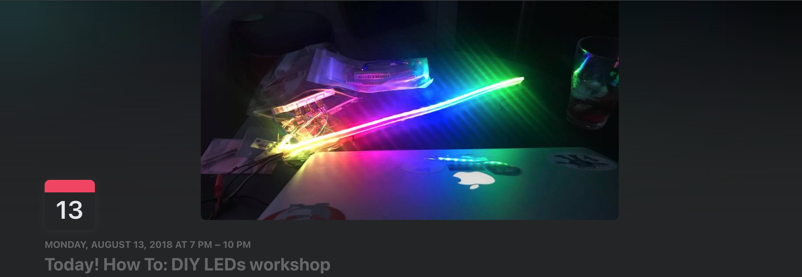
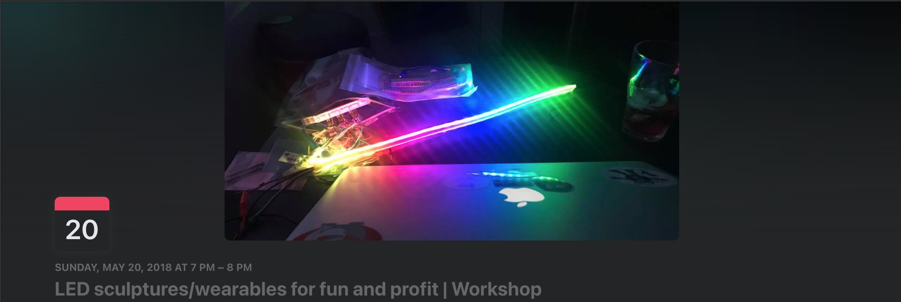

# Workshops

## 2018

### [August 13 - How To: DIY LEDs workshop](https://www.facebook.com/events/254670852027824/)

#### Description

Do you want to make your own custom LEDs for that thing in the desert?

In this workshop I'll provide you with EVERYTHING you need to make a custom LED setup (Board, LED strip, and programming know-how).

This workshop is limited to 8 people since that's all I have supplies for. However, this meeting will also be held over video conference so feel free to follow along if you have your own supplies.

NOTE: I'm hosting this where I work, and I can only bring 10 people into the building. If there is enough interest, I can get a coworker involved so we can bring more people.

What YOU need to bring:
- Idea of what you want to do with a strip of LEDs (1-2ft)
- A laptop so we can install the Arduino IDE and flash your circuit boards
- A Micro USB cable to connect your board to your laptop (I don't have enough for everyone)
- (Optional) USB phone charger battery pack -> only needed if you want to make your LEDs portable, which you probably do?

What will be provided:
- 1 ESP32 circuit board (https://www.adafruit.com/product/3405)
- LEDs (https://www.adafruit.com/product/2562 & https://www.adafruit.com/product/1461?length=1)
- Wires/connectors to connect everything

### May 20 - LED Sculptures/Wearables for fun and profit | Workshop

#### Description

Workshop Part 1: Getting started with Arduino IDE

Please bring your laptop to this meeting! That’s totally okay if you don’t have a laptop, but to get the most out of this first workshop it’s a massive help to bring one.

I’ll walk through what software and modules to install for the ideal boards/LEDs we plan to use in later workshops. The goal of this workshop is to get your computer setup so we can push code to the boards that control the LEDs.

At the end I’ll give everyone a list of parts to buy for the next workshop.

—————————————————————

Come learn how to make your own LED artwork.

I’ll cover the basics, everything from what to buy, where to order it, what software to download, what code to write, what wires to connect, and how to power it!

All I ask is that you bring the required workshop items (only if you plan on making something during the workshop, which you totally should, otherwise why go?)

Also bring your imagination!

I’ll update details on what workshop supplies to order. Also, I’m currently looking for a location to host this.
Feel free to bring a friend or two.