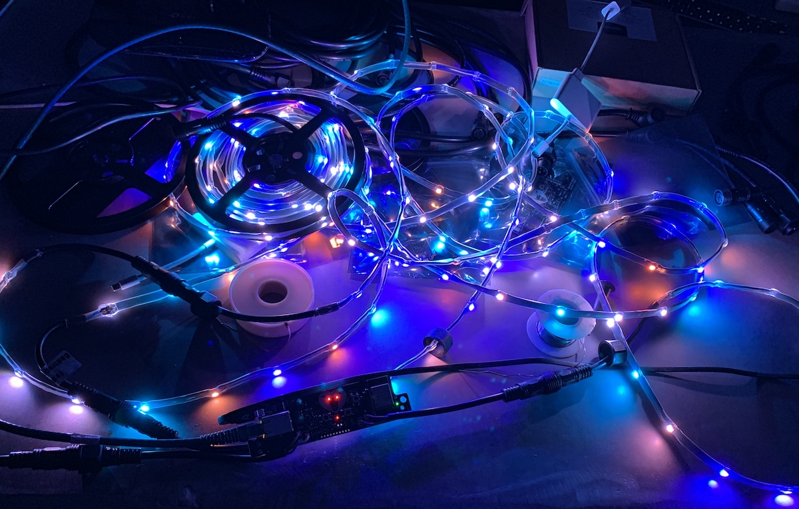
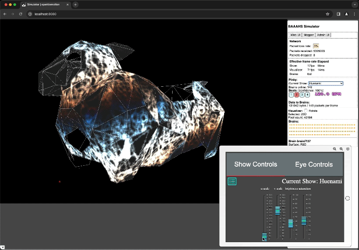

# Sparkle Motion

## Overview

[Sparkle Motion](https://github.com/baaahs/sparklemotion) is a tool for controlling and interacting with over 60,000+ LEDs on the [BAAAHS](https://baaahs.org/) Burning Man art car.

An interface for playing with light.

|                      |                                                                                                        |
| -------------------- | ------------------------------------------------------------------------------------------------------ |
| <b>Role</b>          | Co-lead, designer, developer                                                                           |
| <b>Collaborators</b> | Lead: [Christian Williams](https://github.com/xian), Co-lead: [Tom Seago](https://github.com/tomseago) |
| <b>GitHub</b>        | [https://github.com/baaahs/sparklemotion](https://github.com/baaahs/sparklemotion)                     |
| <b>Tech</b>          | LEDs, Kotlin, React.js, GLSL                                                                           |

:::important

I co-led this massive volunteer effort along with [Christian Williams](https://github.com/xian) and [Tom Seago](https://github.com/tomseago).

My specific contributions include:

- Designed and developed core web UI elements in React.js.
- Developed the initial API Proposal for light shows and contributed commits to pass data to the web front end from the Kotlin back end.
- Designed the LED form factor to use in the panels.

See the [complete list of my commits](https://github.com/baaahs/sparklemotion/commits?author=r3dcrosse) and the [full list of contributors](https://github.com/baaahs/sparklemotion/graphs/contributors). Thank you to all the volunteers that helped make this project possible!

:::

## Initial LED Panel Prototype

I chose a particular wiry form of LED in the initial panel prototype.

The LED's wiry, bendy form illuminates the panel in a certain tie-dye likeness. 

The randomness of the placement of each pixel lends an organic quality to the light.

## Web UI for interacting with LEDs

I developed the control panel UI, including the slider components.

## 3D Simulator and Web UI

The 3D simulator includes an interactive iPad preview interface for controlling the running light show. A majority of our light shows are written in OpenGL Shading Language (GLSL).

## Panel Mapping

Each LED panel gets mapped relative to its geometry on the 3D model of the art car. Only 1/2 of the panels on the art car get mapped: the driver's side, which contains the DJ booth. [Christian Williams](https://github.com/xian) developed the computer vision mapping feature built into the Sparkle Motion Web UI.

## Assembling Panels

Thank you to all the volunteers that helped assemble panels and the art car!

## Result

### Test Run

A test run of the first LED light show.

### Happy Partygoers

A crowd of happy partygoers dances as the legendary [Carl Cox](https://carlcox.com/) DJs from the BAAAHS art car. The art car is also a mobile sound system.

<video controls width="50%">
  <source src="/video/baaahs_party.mp4" type="video/mp4" />
  <source src="/video/baaahs_party.webm" type="video/webm" />
</video>
