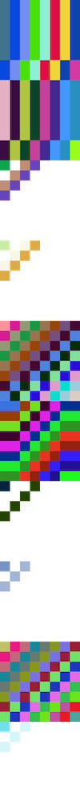

import MaybeInteractive from "../../src/components/MaybeInteractive";
import PixelGenerator, {
  Controls,
  Art,
} from "../../src/components/PixelGenerator";

# Painting poems from hashes

## Overview

Inspired by GitHub's default profile avatar [identicon](https://en.wikipedia.org/wiki/Identicon), I wanted to build a tool that generates visuals from any text, from a poem to source code to quotes or paragraphs of a novel.

This web UI tool lets anyone generate visuals from text and download a .png of the final result.

<table>
  <tr>
    <td>
      <b>Role</b>
    </td>
    <td>Creator, designer, developer</td>
  </tr>
  <tr>
    <td>
      <b>Link</b>
    </td>
    <td>https://mrwayman.com/painting-poems-from-hashes</td>
  </tr>
  <tr>
    <td>
      <b>Source Code</b>
    </td>
    <td>https://github.com/r3dcrosse/mrwayman/blob/main/src/components/HashPainting/index.tsx</td>
  </tr>
  <tr>
    <td>
      <b>Tech</b>
    </td>
    <td>React.js, SHA-256, CSS Hex Colors</td>
  </tr>
</table>

## Concept

### Hash

I started by using a browser `<input />`, generating a SHA-256 hash from the text, then rendering the hash in a grid.

<MaybeInteractive
  src="/img/hash-painting-concept.gif"
  alt="Hash painting concept"
>
  

    <PixelGenerator art={Art.rawHash} defaultText="Hello, world!" />
    
  

</MaybeInteractive>

### Color

The hash grid resembles a word search where we can find hex colors anywhere within the grid.

Here's an example: let's use every six characters as our hex color and set it as the background color in each pixel.

<MaybeInteractive
  src="/img/hash-grid-color-concept.gif"
  alt="Hash painting concept with colors"
>
  

    <PixelGenerator art={Art.horizontalHexColor} defaultText="Hello, world!" />
    
  

</MaybeInteractive>

Let's use a different algorithm for finding hex colors in our grid.

<MaybeInteractive
  src="/img/hash-grid-color-concept-2.gif"
  alt="Hash painting concept with diagonal colors"
>
  

    <PixelGenerator art={Art.verticalHexColor} defaultText="Hello, world!" />
    
  

</MaybeInteractive>

## Result

### Web UI

Packaging the above concepts into a web UI, we get a tool that generates text-based visuals.

The length of each word determines the pixel pattern generated.

### Saving as a .png

The hash painting can also be saved and downloaded from the tool.

