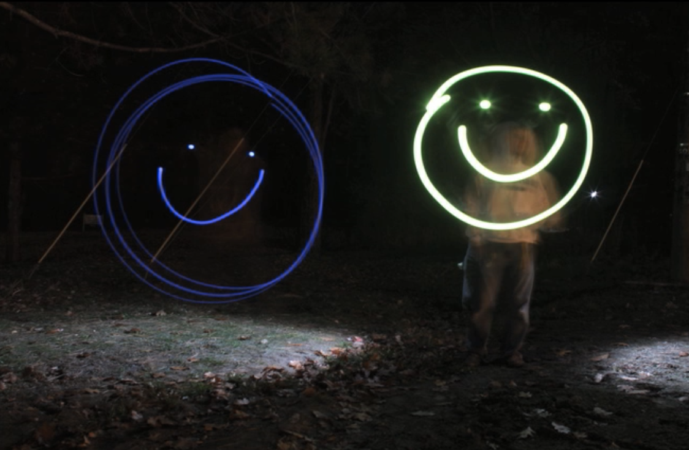
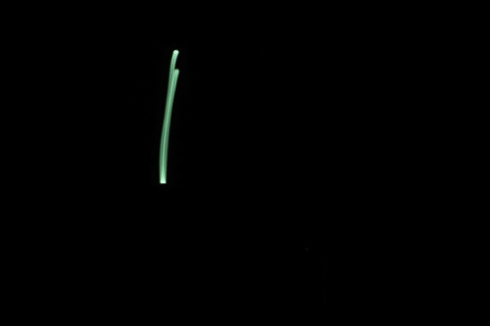
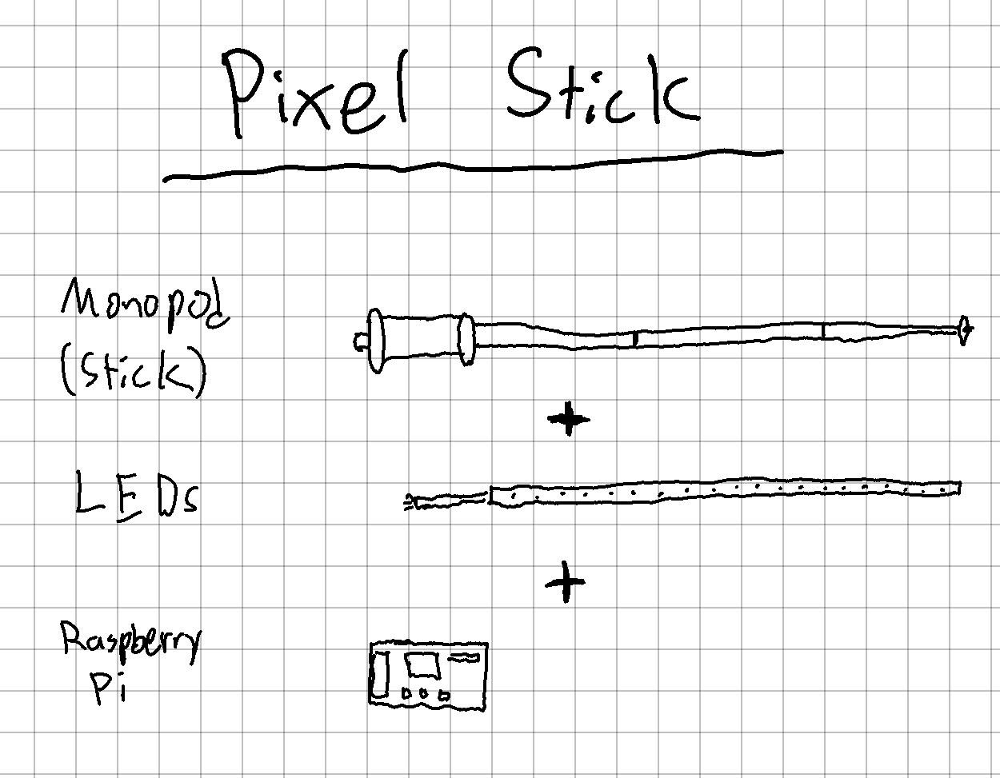
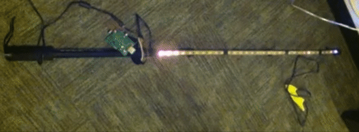
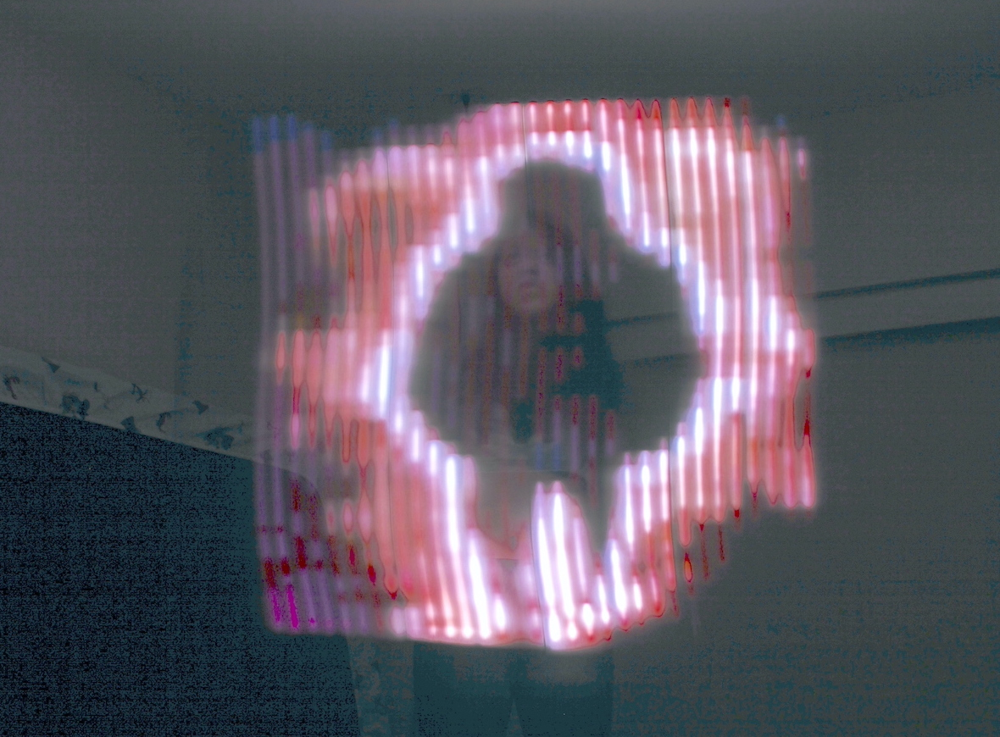

# Animating paintings of light

## Overview

Engaging with the past by reproducing frames from [Ryan Larkin’s _Walking_ (1968)](https://www.nfb.ca/film/walking/), using long-exposure photographs of an LED stick in motion.

<table>
  <tbody>
    <tr>
      <td>
        <b>Role</b>
      </td>
      <td>Maker, designer, developer</td>
    </tr>
    <tr>
      <td>
        <b>Collaboration</b>
      </td>
      <td>Ryan Larkin's [_Walking_ (1968)](https://www.nfb.ca/film/walking/)</td>
    </tr>
    <tr>
      <td>
        <b>Tech</b>
      </td>
      <td>LEDs, Python, Raspberry Pi, Long-exposure Photography</td>
    </tr>
  </tbody>
</table>

## Concept

### Light painting

Long-exposure photography makes it possible to produce a sketch of light, known as a light painting.

### Problems with animating light painting

Manually sketching with light becomes physically exhausting after drawing more than a hundred frames. Drawing each frame out of thin air is incredibly difficult, and the natural inconsistencies between each drawn frame create a campy aesthetic.

I thought about ways to automate this and make the process less exhausting.

> What if we could print the light painting instead of drawing it?

Yes! We can print the light painting with LEDs like a dot matrix printer!

### Pixel stick prototype

Introducing the pixel stick.

Combining a monopod, LED strip, and Raspberry Pi as a microcontroller running a Python script to control the LEDs, we have a tool that lets us print each row of an image during a long-exposure photograph.

### Printing the image

Performing image processing in Python, we can take each row of pixels of an image and then flash them onto the row of LEDs.

Here's the result of moving the pixel stick while taking a long-exposure photograph, essentially printing an image out of thin air.

## Result

Putting together each photograph, we've reproduced a segment of [Ryan Larkin’s _Walking_ (1968)](https://www.nfb.ca/film/walking/) in the digital-age, as a light painting.

## Lessons learned

This was my first experience building a custom tool to achieve an artistic vision, and **I learned that technology only sometimes makes things easier and that there are tradeoffs.**

Ultimately, working with the pixel stick proved impractical after over a hundred frames for similar reasons as our [initial problems](#problems-with-animating-light-painting) with animated light painting.

Although producing each print was more effortless than manually drawing each frame, the amount of post-production processing needed to create a quality animation made continuing the experiment impractical in search of more achievable animation methods.

I stepped back and leaned into the campy aesthetic of light painting by hand to produce a whimsical animation of an electric toaster.

