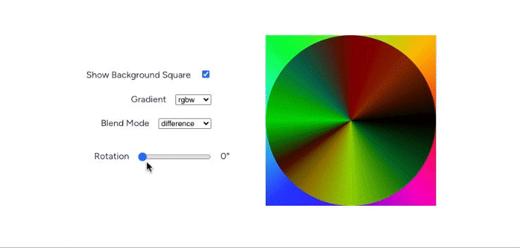

import MaybeInteractive from "../../src/components/MaybeInteractive";
import InteractiveColorWheel from "../../src/components/InteractiveColorWheel";

# Exploring CSS: mix-blend-mode

## Overview

Inspired by [Felipe Pantone's](https://www.felipepantone.com/) kinetic color wheel [installations](https://www.instagram.com/reel/CzV_9kcoRdO/), I wanted to build a pedagogical tool that mimics a similarly playful, colorful experience in the browser.

<table>
  <tbody>
    <tr>
      <td>
        <b>Role</b>
      </td>
      <td>Creator, developer</td>
    </tr>
    <tr>
      <td>
        <b>Inspired By</b>
      </td>
      <td>[Felipe Pantone](https://www.felipepantone.com/)</td>
    </tr>
    <tr>
      <td>
        <b>Link</b>
      </td>
      <td>https://mrwayman.com/color-wheel</td>
    </tr>
    <tr>
      <td>
        <b>Tech</b>
      </td>
      <td>React.js, HSL Color, CSS mix-blend-mode, Web Browser</td>
    </tr>
  </tbody>
</table>

## Interactive Browser Color Wheels

Check out the all-in-one [Interactive Browser Color Wheel UI](https://mrwayman.com/color-wheel).

### Concept

Let's start with a basic HSL color wheel over an HSL color square.

<MaybeInteractive
  alt="HSL color wheel over an HSL color square"
  src="/img/mix-blend-mode/concept.gif"
>
  <InteractiveColorWheel />
</MaybeInteractive>

## Mix Blend Modes

Let's explore all the [browser-native](https://developer.mozilla.org/en-US/docs/Web/CSS/mix-blend-mode) mix-blend-modes.

### Multiply

<MaybeInteractive
  alt="css mix-blend-mode multiply"
  src="/img/mix-blend-mode/multiply.gif"
>
  <InteractiveColorWheel mixBlendMode="multiply" />
</MaybeInteractive>

### Screen

<MaybeInteractive
  alt="css mix-blend-mode screen"
  src="/img/mix-blend-mode/screen.gif"
>
  <InteractiveColorWheel mixBlendMode="screen" />
</MaybeInteractive>

### Overlay

<MaybeInteractive
  alt="css mix-blend-mode overlay"
  src="/img/mix-blend-mode/overlay.gif"
>
  <InteractiveColorWheel mixBlendMode="overlay" />
</MaybeInteractive>

### Darken

<MaybeInteractive
  alt="css mix-blend-mode darken"
  src="/img/mix-blend-mode/darken.gif"
>
  <InteractiveColorWheel mixBlendMode="darken" />
</MaybeInteractive>

### Lighten

<MaybeInteractive
  alt="css mix-blend-mode lighten"
  src="/img/mix-blend-mode/lighten.gif"
>
  <InteractiveColorWheel mixBlendMode="lighten" />
</MaybeInteractive>

### Color-Dodge

<MaybeInteractive
  alt="css mix-blend-mode color-dodge"
  src="/img/mix-blend-mode/color-dodge.gif"
>
  <InteractiveColorWheel mixBlendMode="color-dodge" />
</MaybeInteractive>

### Color-Burn

<MaybeInteractive
  alt="css mix-blend-mode color-burn"
  src="/img/mix-blend-mode/color-burn.gif"
>
  <InteractiveColorWheel mixBlendMode="color-burn" />
</MaybeInteractive>

### Hard-Light

<MaybeInteractive
  alt="css mix-blend-mode hard-light"
  src="/img/mix-blend-mode/hard-light.gif"
>
  <InteractiveColorWheel mixBlendMode="hard-light" />
</MaybeInteractive>

### Soft-Light

<MaybeInteractive
  alt="css mix-blend-mode soft-light"
  src="/img/mix-blend-mode/soft-light.gif"
>
  <InteractiveColorWheel mixBlendMode="soft-light" />
</MaybeInteractive>

### Difference

<MaybeInteractive
  alt="css mix-blend-mode difference"
  src="/img/mix-blend-mode/difference.gif"
>
  <InteractiveColorWheel mixBlendMode="difference" />
</MaybeInteractive>

### Exclusion

<MaybeInteractive
  alt="css mix-blend-mode exclusion"
  src="/img/mix-blend-mode/exclusion.gif"
>
  <InteractiveColorWheel mixBlendMode="exclusion" />
</MaybeInteractive>

### Hue

<MaybeInteractive
  alt="css mix-blend-mode hue"
  src="/img/mix-blend-mode/hue.gif"
>
  <InteractiveColorWheel mixBlendMode="hue" />
</MaybeInteractive>

### Saturation

<MaybeInteractive
  alt="css mix-blend-mode saturation"
  src="/img/mix-blend-mode/saturation.gif"
>
  <InteractiveColorWheel mixBlendMode="saturation" />
</MaybeInteractive>

### Color

<MaybeInteractive
  alt="css mix-blend-mode color"
  src="/img/mix-blend-mode/color.gif"
>
  <InteractiveColorWheel mixBlendMode="color" />
</MaybeInteractive>

### Luminosity

<MaybeInteractive
  alt="css mix-blend-mode luminosity"
  src="/img/mix-blend-mode/luminosity.gif"
>
  <InteractiveColorWheel mixBlendMode="luminosity" />
</MaybeInteractive>
