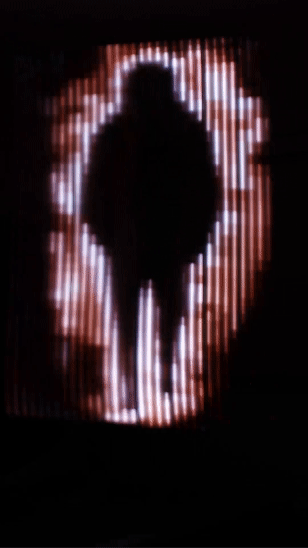
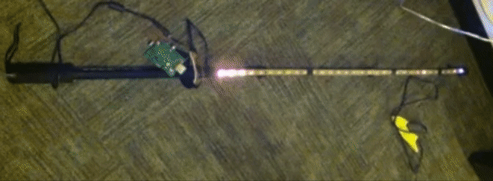
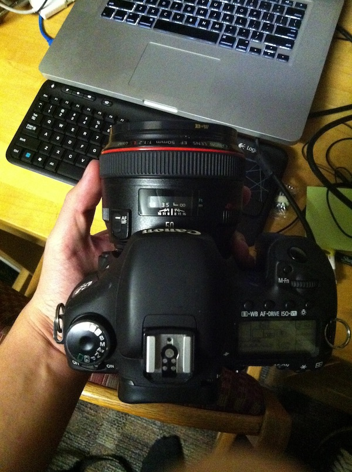

import MaybeInteractive from "../../components/MaybeInteractive";
import ColorWheel from "../../components/ColorWheel";

# Table of contents

1. [Sparkle Motion]
1. [Painting With Hashes]
1. [LED Light Painting Animation](#1--led-light-painting-animation)
1. [Glowing Rat Compass](#2--glowing-rat-compass)

## 1 | Sparkle Motion

## 1 | LED Light Painting Animation

### Situation

Reproducing frames from [Ryan Larkin’s _Walking_ (1968)](https://www.nfb.ca/film/walking/) using long-exposure photographs of an LED stick in motion.

An interesting approach to adding a human touch to what is normally a perfect digital grid of pixels. The imperfection of human motion during each long-exposure photograph (it’s incredibly difficult to move the LED stick by hand in a consistent manner, frame after frame) produces an analog aesthetic similar to a movie on actual film.

### Action

Built a "pixel stick" using a strip of individually addressable LEDs connected to a Raspberry Pi, running a Python script that flashed each row of pixels from an image onto the LEDs.

Took a long-exposure photograph.

Combined images together to create an animation sequence.

### Response

Something

## 2 | Glowing Rat Compass

It started with this thought:

> What if we made use of color to give us direction?
> What would that look like?

No, I don't have [Synesthesia](https://en.wikipedia.org/wiki/Synesthesia), but I do have some LEDs, a Magnetometer (Compass) sensor, and a plastic rat skeleton.

Let's make it possible to interact with Earth's magnetic field as a colorful, synesthetic experience.

<MaybeInteractive alt="testing" src="/img/og_color_concept.gif">
  <ColorWheel />
</MaybeInteractive>
